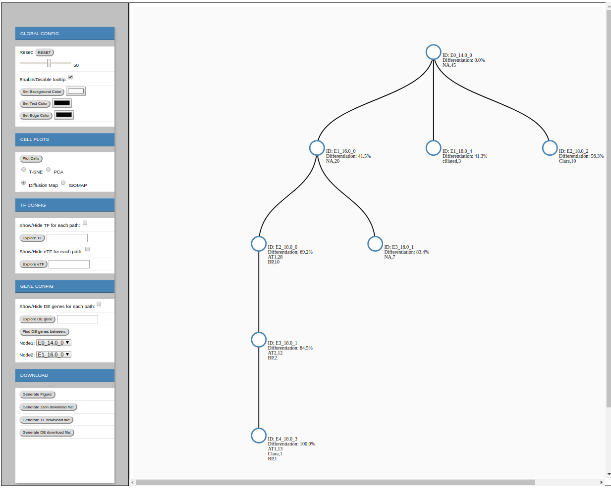
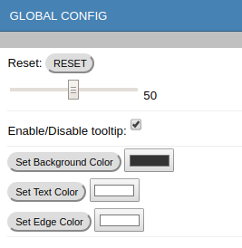
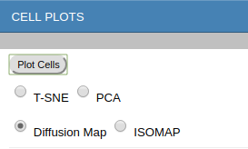
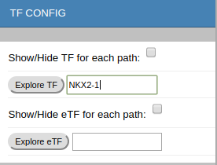
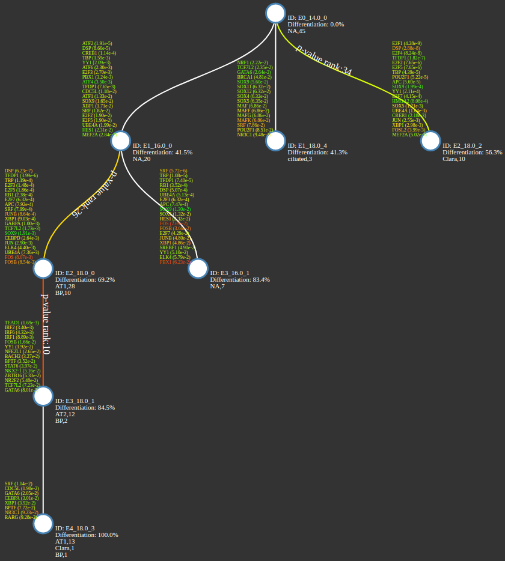
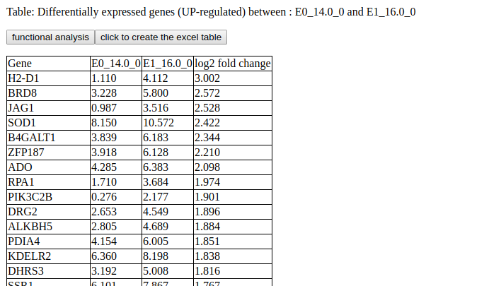
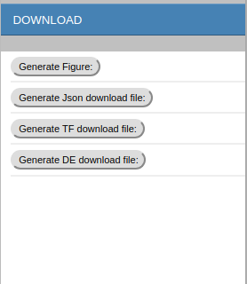

			 ____  ____  ____  _  _____ _____
			/ ___\/   _\/  _ \/ \/    //    /
			|    \|  /  | | \|| ||  __\|  __\
			\___ ||  \__| |_/|| || |   | |   
			\____/\____/\____/\_/\_/   \_/    

[](https://travis-ci.org/phoenixding/scdiff)
[](https://opensource.org/licenses/MIT)

# INTRODUCTION 
<div style="text-align: justify"> 
Most existing single-cell trajectory inference methods have relied primarily on the assumption that descendant cells are similar to their parents in terms of gene expression levels. 
These assumptions do not always hold for in-vivo studies which often include infrequently sampled, un-synchronized and diverse cell populations. 
Thus, additional information may be needed to determine the correct ordering and branching of progenitor cells and the set of transcription factors (TFs) 
that are active during advancing stages of organogenesis. To enable such modeling we developed scdiff,
which integrates expression similarity with regulatory information to reconstruct the dynamic developmental cell trajectories. 


SCDIFF is a package written in python and javascript, designed to analyze the cell differentiation trajectories
using time-series single cell RNA-seq data. It is able to predict the
transcription factors and differential genes associated with the cell differentiation trajectoreis. 
It also visualizes the trajectories using an interactive tree-stucture graph, in which nodes
represent different sub-population cells (clusters). 
</div>  


# PREREQUISITES

* python (python 2 and python 3 are both supported)  
It was installed by default for most Linux distribution and MAC.  
If not, please check [https://www.python.org/downloads/](https://www.python.org/downloads/) for installation 
instructions. 

* Python packages dependencies:  
-- scikit-learn >=0.20    
-- scipy >=0.13.3  
-- numpy >=1.8.2  
-- matplotlib  >=2.2.3  
-- pydiffmap >=0.1.1  
-- imbalanced_learn >=0.4.2   

The python setup.py script (or pip) will try to install these packages automatically.
However, please install them manually if, by any reason, the automatic 
installation fails. 

# INSTALLATION
 
 There are 3 options to install scdiff.  
* __Option 1: Install from download directory__   
	cd to the downloaded scdiff package root directory

	```shell
	$cd scdiff
	```
	run python setup to install   

	```shell
	$python setup.py install
	```
		
	MacOS or Linux users might need the sudo/root access to install. 
	Users without the root access can install the package using the pip/easy_install with a --user parameter ([install python libraries without root](https://stackoverflow.com/questions/7465445/how-to-install-python-modules-without-root-access))．
	 
	```shell  
	$sudo python setup.py install 
	```
	use python3 instead of python in the above commands to install if using python3. 
	
* __Option 2: Install from Github__ (recommended):    

	python 2:  
	```shell
	$sudo pip install --upgrade https://github.com/phoenixding/scdiff/zipball/master
	```
	python 3: 
	```shell
	$sudo pip3 install --upgrade https://github.com/phoenixding/scdiff/zipball/master
	```


* __Option 3: Install from PyPI__ :    
 
	python2:   
	```
	$sudo pip install --upgrade scdiff
	```
	python 3:
	```
	$sudo pip3 install --upgrade scdiff
	```
The above pip installation options should be working for Linux, Window and MacOS systems.   
For MacOS users, it's recommended to use python3 installation. The default python2 in MacOS has
some compatibility issues with a few dependent libraries. The users would have to install their own
version of python2 (e.g. via [Anocanda](https://anaconda.org/)) if they prefer to use python2 in MacOS.  

# USAGE

```shell
scdiff.py [-h] -i INPUT -t TF_DNA -k CLUSTERS -o OUTPUT [-l LARGE]
                 [-s SPEEDUP] [-d DSYNC] [-a VIRTUALANCESTOR]
                 [-f LOG2FOLDCHANGECUT] [-e ETFLISTFILE] [--spcut SPCUT]

	-h, --help            show this help message and exit

	-i INPUT, --input INPUT, required 
						input single cell RNA-seq expression data
						
	-t TF_DNA, --tf_dna TF_DNA, required
						TF-DNA interactions used in the analysis
						
	-k CLUSTERS, --clusters CLUSTERS, required
						how to learn the number of clusters for each time
						point? user-defined or auto? if user-defined, please
						specify the configuration file path. If set as "auto"
						scdiff will learn the parameters automatically.
						
	-o OUTPUT, --output OUTPUT, required
						output folder to store all results
						
	-s SPEEDUP, --speedup SPEEDUP(1/None), optional
						If set as 'True' or '1', SCIDFF will speedup the running
						by reducing the iteration times.
						
	-l LARGETYPE,  --largetype LARGETYPE (1/None), optional
						if specified as 'True' or '1', scdiff will use LargeType mode to 
						improve the running efficiency (both memory and time). 
						As spectral clustering is not scalable to large data,
						PCA+K-Means clustering was used instead. The running speed is improved 
						significantly but the performance is slightly worse. If there are
						more than 2k cells at each time point on average, it is highly 
						recommended to use this parameter to improve time and memory efficiency.
						
						
	-d DSYNC,  --dsync DSYNC (1/None), optional
						If specified as 'True' or '1', the cell synchronization will be disabled. 
						If the users believe that cells at the same time point are similar in terms of 
						differentiation/development. The synchronization can be disabled.

	-a VIRTUALANCESTOR, --virtualAncestor VIRTUALANCESTOR (1/None), optional
						scdiff requires a 'Ancestor' node (the starting node, 
						all other nodes are descendants).  By default, 
						the 'Ancestor' node is set as the first time point. The hypothesis behind is :  
						The cells at first time points are not differentiated yet
						( or at the very early stage of differentiation and thus no clear sub-groups, 
						all Cells at the first time point belong to the same cluster).  
						  
						If it is not the case, users can set -a as 'True' or '1' to enable
						a virtual ancestor before the first time point.  The expression of the 
						virtual ancestor is the median expression of all cells at first time point. 
						 
	-f LOG2FOLDCHANGECUT, --log2foldchangecut LOG2FOLDCHANGECUT (Float), optional
						By default, scdiff uses log2 Fold change 1(=>2^1=2)
						as the cutoff for differential genes (together with t-test p-value cutoff 0.05).
						However, users are allowed to customize the cutoff based on their 
						application scenario (e.g. log2 fold change 1.5). 
						
	-e ETFLISTFILE, --etfListFile ETFLISTFILE (String), optional  
						By default, scdiff recognizes 1.6k
						TFs (we collected in human and mouse). Users are able
						to provide a customized list of TFs instead using this
						option. It specifies the path to the TF list file, in
						which each line is a TF name. Here, it does not require 
						the targets information for the TFs, which will be used to infer
						eTFs (TFs predicted based on the expression of themselves instead of the their targets).
						
	--spcut SPCUT       Float, optional  
						By default, scdiff uses p-value=0.05
                        as the cutoff to tell whether the DistanceToAncestor
                        (DTA) of clusters are significantly different.
                        Clusters with similar DTA will be placed in the same
                        level.

                        
```
# INPUTS AND PRE-PROCESSING

scdiff takes the two required input files (-i/--input and -t/--tf_dna), two optional files (-k/--cluster, -e/--etfListFile) and a few other optional parameters. 

* __-i/--input__  
(<span style="color:red">Note: The gene names in the expression file must be consistent with those in [TF_DNA](tf_dna/Human_TF_targets.txt) file. If using the provided [TF_DNA](tf_dna/Human_TF_targets.txt) file, [gene symbols](https://ghr.nlm.nih.gov/about/gene-names-symbols) must be used to represent the genes in the expression file.</span>)  
This specifies the single cell RNA-Seq expression data.  
If the RNA-Seq data is not processed, the instruction about how to calculate expression based on RNA-Seq raw reads can be found in many other studies, e.g (https://www.ncbi.nlm.nih.gov/pmc/articles/PMC4728800/).
For example, users can use Tophat + Cufflink to calculate the gene expression in terms of FPKM.  Please refer to corresponding tools for instructions. 
Once we get the RNA-Seq gene expression, the expression data should be transformed to log space for example by log2(x+1) where x could represent the gene expression in terms of RPKM, FPKM,TPM, umi-count depending
on what tools are used to process the RNA-Seq expression data.  
Note: For large expression datasets (e.g. >1Gb), it's recommended to filter the genes with very low variance to speed up and save memory. 
We provided a script [utils/filterGenes.py](utils/filterGenes.py) in the utils folder for this purpose (please use "--help" parameter to show the usage information).
Top 5000-10,000 genes are enough for most cases as the expression of many genes is quite stable (OR all zeros/very small values for non-expressing genes) and thus non-informative (>80% agreement of the cell assignments with the results using all genes as tested on multiple datasets).  
	```
	//To keep the top 10,000 genes with the largest variance
	$ python filterGenes.py -i example/example.E -n 10000 >updated_ex.tsv
	```
	The input file has the following formatting requirements: 
	* __Header Row__ 
	First 3 columns are "Cells","Time","Label" and the remaining columns are gene names.   
	* __Data Rows__    
		* __1st column__: Cell ID, represents the ID for the cell.  
		* __2nd column__: Cell time, Integer, represents the measurement time of the cell.   
		* __3rd column__: Cell label, represents the label of the cell (e.g cell type if known).   
		In most cases, we don't have any prior knowledge of the cell type. In this case, use "NA" instead.
		Or, you can use any name you want to label each cell. We don't use this information in our model and it's only used to mark the cells with 
		the same attributes (any known attributes users are interested in, for example, cell type, time point, WT/Treatment, etc.) in the visualization. 
		Please avoid too many different labels, which will make the visualization very crowded. It's recommended to use <20 different labels. 
		If, however, users want to use more labels, please use the 'NA' as the label for all cells and use the cell IDs to infer the label composition of each node.   
		* __4th- columns__: Gene expression values.    
	
	Example input:     
	[example.E](example/example.E)
	
* __-t/--tf_dna__  
This specifies the TF-gene interaction data.  In other words, it specifies the TF targets. 
Under the tf_dna directory, we provided a [human TF-gene interaction file](tf_dna/Human_TF_targets.txt) and a [mouse TF-gene interaction file](tf_dna/Mouse_TF_targets.txt) inferred using the strategy in our previous study (https://www.ncbi.nlm.nih.gov/pubmed/20219943). 
Although this TF-gene interactions are collected in human and mouse, they should be also able to apply to other close species.
Besides, in our previous work DREM (http://sb.cs.cmu.edu/drem/), we did collected the TF-gene interactions for common species including human, mouse, fry, E.coli, yeast, Arabidopsis. 
Please refer to  http://sb.cs.cmu.edu/drem/DREMmanual.pdf appendix B for complete details. 
Those TF-gene interaction files can be downloaded from our DREM software (https://github.com/phoenixding/idrem/tree/master/TFInput).
You might need to unzip and re-format the file to satisfy the requirements. The TF-gene interaction file has the following formatting requirements:  
 
	* __Header Row__  
	```
	TF	Gene	Input
	```
	* __Data Rows__  
		* __1st column__: TF ID (gene symbol)
		* __2rd column__: gene ID (gene symbol)
		* __3rd column__: Input, optional, the interaction strength between TF and target gene. If missing, by default it's 1.  
		This column is not used in scdiff. 
		 	
	Example file:   
	[example TF gene interaction file](tf_dna/Human_TF_targets.txt)

* __-k/--cluster__  
  This specifies the clustering parameter (String).   
  It's need to be either 'auto' or path to the 'config' file. Here, 'auto' denotes the clustering parameters will be learned automatically.  
  The path to the 'config' file specifies the file with customized initial clustering parameters. This is **highly recommended** when users have some prior knowledge.  
  For example, if we know there are how many sub-populations within each time, 
  we can just directly specify the clustering parameters (K, # of clusters) using the 'config' file.
  Please note that this config file is optional, users can set -k as "auto" and the scdiff will learn the clustering parameters automatically. 
  Config file format:   
 
  * __1st column__: Time point
  * __2nd column__: # of clusters(sub cell-types) at this time point.  
  ```
  14  1  
  16  2  
  18  5
  ``` 
  please note if using the customized config file for clustering, the first line (represents the first time point) second column (# of sub cell-types) must be 1.
  The first line denotes the ancestor time point and all cells at later time points are descendants. However, if the first time point is already differentiated and there
  are already multiple sub-types, users need to use VirtualAncestor option (-a 1) to generate a virtual ancestor node (virtual root node). In the config file,
  a virtual ancestor line also needs to be added before the first time point. The virtual ancestor time point should be FirstTimePoint(Integer)-1.  For example,
  if the first time point is 14, the virtual ancestor time point would be 13.   
  Example  config file: 
  [example.config](example/example.config)
  
* __-e/--etfListFile__  
  This species the path to the TF list file. By default, scdiff recognizes 1.6k TFs we collected in human and mouse.  
  If users want to use their list of TFs, please use this parameter to specify the path to the file.   
  
  Format of the TF List file:
  each row represents a TF standard name and matches to the gene expression names.  
  We required that the predicted TFs must be expressing (based on the expression data).
  
  An example of the TF List file can be found under the "tf_list" folder [HumanTFList.txt](tf_list/Human_mouse_TFList.txt).
  
For other scdiff optional parameters, please refer to the [usage](#usage) section.   

# RECOMMENDED PIPELINE
Please follow the following steps to analyze the single-cell data. 
* (1) Expression file Pre-processing (__MUST__):   
Please convert the expression file into the format as described above. 
For large dataset (e.g. >1Gb), please remove low variance genes using the provided [utils/filterGenes.py](utils/filterGenes.py) script. 
Note: the expression __MUST__ be in log space. 

* (2) Estimate number of Clusters K for each time point in a user-defined or semi-automatic way (__Not Required But Recommended__)  
If users have prior knowledge about how many clusters K approximately (e.g. based on markers) for each time, please specify using the "-k config_file" parameter as described above. 
If no prior knowledge is available, users can choose to estimate the K automatically or semi-automatically with the provided [utils/semiAutomaticK.py](utils/semiAutomaticK.py) script.   
Although scdiff can estimate the number of Clusters K for each time point in a fully automatic way with "-k auto" option, but it's very time-consuming and in many cases users are able to get better estimation 
using their eyes with the help of the visualization (e.g., TSNE plot). semiAutomaticK.py script draws the TSNE plots to help users to determine possible number of clusters K for each time point. 
Then users can run scdiff with the option: "-k config_file".  The TSNE plot will be output to a pdf file (*.tsne.pdf). 
```
$python semiAutomaticK.py -i example.E
```


* (3) Specify the root cells (__Not Required But Recommended__)  
By default, the program uses all the cells at the first time point as the starting root. 
This was based on the assumption that the cells in the first point are very similar (not well-differentiated yet) and serve as the 
ancestors for all the remaining cells.  If this assumption is not valid, users can use -a 1 to specify a virtual ancestor. 
The expression of such virtual ancestor is the average expression of the cells at the first time point. 
In many cases, users have prior knowledge of the starting cell types (e.g., based on markers). 
Under such scenario, users can add choose one/ a few cells (e.g., with a very high expression of the marker genes) as the user defined root to the expression file.  
The root time point should be FirstTimePoint(Integer)-1. For example, if the first time point is 14, the root time point would be 13. 
Note, don't use "-a 1" parameter if a user-defined root is added to the expression file. 
For example:  
original expression file:  
	```
	cell_id	time	label	gene1	gene2	gene3
	c1	1	type1	1.0	2.0	3.0
	c2	1	type2	2.0	1.0	3.0
	...
	c5	2	type2	3.0	1.0	2.0
	```
	
	->updated expression file with a specified root (specify c1 as the root):  
	
	```
	cell_id	time	label	gene1	gene2	gene3
	root	0	type1	1.0	2.0	3.0
	c2	1	type2	2.0	1.0	3.0
	...
	c5	2	type2	3.0	1.0	2.0
	```
	If there is no prior knowledge about the starting root cell/cells, users can turn to the help of visualization methods.
	For example, users can use the [diffusion map] (https://pypi.org/project/pydiffmap/) to help determining the root cell(s). 
	Users can also use the diffusion map visualization in the CELL PLOT section from the scdiff running results.   
	.
* (4) Run scdiff as described in USAGE section (__MUST__)
* (5) Re-visit the results and re-run the program if needed (__Not Required But Highly Recommended__).  
With the generated visualizations in the "CELL Plots" section and other results, users will have a better understanding
of the studied process (e.g. number of clusters K, root cells). For example, the time point information is used in our analysis. However, it's not informative and often misleading in some cases 
(in which the measurement time is not correlated with the cell states at all). If this is indicated in the initial analysis, it's recommended 
to re-run the program without using time-point information (use the same time points for all cells). Users can use the provided [utils/filterGenes.py](utils/filterGenes.py)
to set the time point of all cells to a given number. 
	```
	$python filterGenes.py -i <ex_file>  -n <number_of_top_genes_for_analysis> --setime <time_point>
	```
	For better results, users can choose to re-run the program by
	specifying the the following parameters with the knowledge learned from initial results.     
		__(i)__  -k config_file  
		Specifying Number of clusters for each time.  
		__(ii)__ -i UPDATED_ex_file  
		Adding the user-defined root cell(s) to the expression file and/or ignoring the time point inforamtion of cells. 
		
	```
	cell_id	time	label	gene1	gene2	gene3
	c1	1	type1	1.0	2.0	3.0
	c2	1	type2	2.0	1.0	3.0
	...
	c5	1	type2	3.0	1.0	2.0
	```

# RESULTS AND VISUALIZATION

The results are given under the specified directory. 
The predicted model was provided as a json file, which is visualized by the
provided JavaScript. Please use *Chrome/FireFox/Safari* browser for best experience.   



The following is the manual for the visualization page. 

**Visualization Config (Left panel)**:  
  
* **GLOBAL Config**:  
	      
	* **RESET** : It restores all configs to default. The slider blow resizes the visualization. 
	* **Enable/Diable tooltip**: By Enabling the tooltip, users are able to see the percentages for each type of cell labels in the node.   
	* ** Set Color**: Users are allowed to customize the background, text and edge colors using the Set Background/Text/Edge color buttons.   
	 
* **CELL PLOTS**:  
	  
	* **Plot Cells**: show PCA/TSNE/ISOMAP plots for all cells and the clusters (use the radio button to select the dimension reduction method : PCA/T-SNE/ISOMAP/Diffusion Map for visualization).
	
	By clicking the cluster labels on the top, users are able to show/hide the cells from that cluster. 
	
	
* **TF CONFIG** :  
	
	* **Show/Hide TF** : display/hide the regulating TFs (TFs predicted based on the expression of their targets) for each path.
	If the targets of a TF x is significantly differentially expressed along a edge e, 
	then TF x is predicted to regulate edge e.  	
	* **Explore  TF** : highlight the regulating paths for given TF; show the expression profile of the input TF and the average fold change of the TF targets. 
	   
	* **SHow/Hide eTF**: display/hide the regulating eTFs (TFs predicted based on the expression of themselves). 
	eTFs are the TFs predicted based on expression of themselves instead of the expression 
	of their targets. If the expression of the TF x in one node (cluster y) is **significiantly** different compared to both 
	the parent (z) and all the siblings, the TF will be predicted as eTF to regulate the edge between nodes(y->z). 
	eTFs are very good complements to the target-based TFs as the TF target information is 
	often limited and incomplete. We may miss important TFs, which only have no or very limited known targets, 
	using only target-based methods.  
	* **Explore eTF**: hightlight the regulating paths for given eTF; show the expression profile of the input eTF and the average fold change of the eTF targets.    
	
* **GENE CONFIG**:  
	
	* **Show/Hide DE**: display/hide the differentially expressed genes for each edge.  
	* **Explore DE gene** : highlight the paths with those DE genes and also show the expression profile of the input gene.     
	* **Find DE genes between** : find the differentially expressed genes between two specified nodes. Use the dropdown menu to specify two nodes for comparison. 
	On the results page, click the "functional analysis" button to perform a gene enrichment anlayis using PANTHER (or ToppGene by shift+click).
	
* **Download**:   
	
	* **Generate Figure**: download the visualization figure.
	* **Generate Json download file**: download the json file, which contains all information of the model.   
		
		```
		Json format:   
		{
			"GeneList": [List of gene symbols],
			"CellList": [                       // list of all cells
				{	
					// a cell instance
					"TE": [x0,y0], // cell coordinates in 2D space projected by T-SNE 
					"PE": [x1,y1], // cell coordinates in 2D space projected by PCA
					"IE": [x2,y2], // cell coordinates in 2D space projected by ISOMAP
					"ME": [x3,y3], // cell coordinates in 2D space projected by Diffusion map
					"typeLabel": cell Label, // label of the cell if known
					"ID": cell ID,
					"T": cell measure time
					
				},
				...
			],
			
			"NodeList":[                      // list of all nodes in Graph
				{	
					// a node instance
					"E": [list of gene expression in node, please refer to GeneList for gene symbols],
					"parent": parent node index,
					"children": list of children node indexes,
					"CELL": list of cell indexes, // all the cells assigned to the node
					"T": node time //estimated node level
					"ID": node ID 
					"eTF": list of TFs predicted based on their own expressions
				},
				...
			],
			"EdgeList":[                   // list of all edges in Graph
				{
					// an edge instance
					"to": edge target node index,
					"from": edge source node index,
					"de": List of differential genes along the edge,
					"etf": List of regulating TFs for the edge
					
				},
				...
			]
			
		}
		```  
	* **Generate TF download File** : download regulating TFs for all paths.
	* **Generate DE download file**: download DE genes for all paths. 

**Visualization Canvas (Right Panel)**:

* mouse over each node to show the pie chart of cell types within each node (need to enable the tooltip).
* left click each node to show:
	* Table 0: Cell IDs (with labels) within the node. 
	* Tabel 1: Regulating TFs for the edge ending at the node.
	* Tabel 2: Regulating eTFs for the edge path ending at the node. 
	* Table 3: DE genes (up-regulated) for the edge ending at the node.
	* Table 4: DE genes (down-regulated) for the edge ending at the node
	
	
# EXAMPLES
 
Run scdiff on given time-series single cell RNA-seq data.  
An example script [exampleRun.py](example/exampleRun.py) is provided under the example directory.
  
**1) Run with automatic config**

```shell
$ scdiff -i example.E -t example.tf_dna -k auto -o example_out
```
* **-i/--input**:   
**example.E** is the single cell RNA-seq dataset with following format (tab delimited)

	```
	cell_ID	time	cell_label	ex_gene1	ex_gene2	...	ex_geneN
	```

	* cell_ID: ID of the cell.
	* time: measure time of the cell RNA-seq.
	* cell_lable: known label for the cell (if available) ,if not , denote as NA.
	* ex_genei: expression of gene i (log2 gene expression value). Gene expression can be FPKM or RPM or any other acceptable gene expression measurements.   
	
	Please read **example.E** for an example of acceptable time-series single cell dataset format.  

* **-t/--tfdna**:  
**example.tf_dna** provides the TF-DNA interaction information used in this study (TF target inforamtion) with tab delimited format.
	
	```
	TF	TF_target	Score
	```
	For example: 
	
	```
	ZNF238	TIMM8B	0.9
	SOX9	TIMM8B	0.9
	ZEB1	TIMM8B	0.9
	GATA4	TIMM8B	0.9
	CEBPA	RAB30	0.9
	NKX2-1	RAB30	0.9
	SRF	RAB30	0.9
	SOX5	RAB30	0.9
	SRY	RAB30	0.9
	POU1F1	RAB30	0.9
	POU2F1	RAB30	0.9
	NFKB1	KRI1	0.9
	E2F1	C11ORF35	0.9
	DSP	C11ORF35	0.9
	ELSPBP1	C11ORF35	0.9
	EGR2	C11ORF35	0.9
	EGR1	C11ORF35	0.9
	NR2F2	C11ORF35	0.9
	LMO2	C11ORF35	0.9
	ESR2	C11ORF35	0.9
	HNF1A	C11ORF35	0.9
	EGR3	C11ORF35	0.9
	```
The TF-DNA directory provides the TF-DNA interaction file used in this study.
* **-k/--clusters**:  
This specifies the clustering parameter (String). It's need to be either 'auto' or  path to the 'config' file.
Here, 'auto' denotes the clustering parameters will be learned automatically. 

* **-o/--output**:  
**example_out** is the specified output directory. 


**2) Run with user-defined config** 

```shell
$scdiff -i example.E  -t example.tf_dna -k example.config -o example_out
```

The format of example.E and example.tf_dna are the same as described above. 

**example.config** specifies the custom initial clustering parameters. This was used when we have some prior knowledge.
For example, if we know they are how many sub-populations within each time, we can just directly specify the clustering parameters using
the example.config file, which provides better performance. 

example.config format(tab delimited)

```
time	#_of_clusters
```
For example:  

```
14  1  
16  2  
18  5  
```
However, if we don't have any prior knowledge about the sub-populations within each time point. We will just use the automatic initial clustering. 
:-k auto.

**3) Run scdiff on large single cell dataset** 

```shell
$scdiff -i example.E -t example.tf_dna -k auto -o example_out -l True -s True
```

-i, -t, -k, -o parameters were discussed above.   
For very large dataset (e.g., more than 20k cell), it's recommended to filter genes with very low variance. 
It significantly cuts down the the memory cost and running time. 

* **-l/--large (optional)**  
String, if specified as 'True' or '1', scdiff will use LargeType mode to improve the running efficiency (both memory and time).
The performance will be sacrificed to some extent. K-means will be used for Clustering instead of Spectral clustering. 

* **-s/--speedup (optional)**  
Speedup the convergence, it will reduce the running time significantly. This is highly recommended for large dataset. 
Based on testing on lung single cell dataset (Treutlein 2014), the speedup performance is just slightly worse (2 more cells were miss-assigned )


**(4) Run scdiff on large single cell dataset with synchronization disabled and virtual ancestor**
```shell 
$scdiff -i example.E -t example.tf_dna -k auto -o example_out -l True -s True -d True -a True
```  
-i, -t , -k, -o, -l ,-s parameters were defined above. 

* **-d/--dsync (optional)**  
If set as 'True' or '1', the cell synchronization will be disabled.  By default, the cell synchronization is enabled. 
For large dataset, the users can disable the synchronization to speedup. If the authors have prior knowledge, the synchronization of cells are 
relatively good, users can also disable the synchronization.  

* **-a/--virtualAncestor (optional)**  
If set as 'True' or '1', the virtual ancestor node will be built. By default, the ancestor node is the first time point (all cells at the first time point).

**5) example running result**  

The following link present the results for an example running.   
[example_out](http://www.cs.cmu.edu/~jund/scdiff/result/treutlein2014_lung/treutlein2014_lung.html)


# MODULES  & FUNCTIONS

## scdiff module
This python module is used to perform the single cell differentiation analysis and it builds a graph (differentiation). Users can use the modules by
importing scdiff package in their program.  Besides the description below, we also provided a module testing example inside the example directory under the name [moduleTestExample.py](example/moduleTestExample.py). 

**[scdiff.Cell(Cell_ID, TimePoint, Expression,typeLabel,GeneList)](#cell)<a id="cell"></a>**    
This class defines the cell. 

**Parameters**:  

* **Cell_ID**: String  
The ID  of the cell.
* **TimePoint**: Integer  
Measurement TimePoint of the cell, Integer.  
* **Expression**: List of float  
Expression of all genes.
* **Cell_Label**: String  
The true label for the cell if available, 'NA' if not available. (Note, we don't need  this information for the  model, but it's  useful when
analyzing the result).
* **GeneList** : List of String  
List of gene symbols expressed in the cell.  

**Output**:  
A Cell class instance  (with all information regarding to  a cell)

**Attributes**:
* **ID **: String  
Cell ID  
* **T**: Integer  
Cell Time  
* **GL**: List of String  
List of gene names  
* **E** : List of float
List of gene expression
 
**Example**:

```python
import scdiff
from scdiff.scdiff import *

# reading example cells ...
AllCells=[]
print("reading cells...")
with open("example.E","r") as f:
	line_ct=0
	for line in f:
		if line_ct==0:
			GL=line.strip().split("\t")[3:]
		else:
			line=line.strip().split("\t")
			iid=line[0]
			ti=float(line[1])
			li=line[2]
			ei=[round(float(item),2) for item in line[3:]]
			ci=scdiff.Cell(iid,ti,ei,li,GL)
			AllCells.append(ci)
		line_ct+=1
		print('cell:'+str(line_ct))
```


**[scdiff.Graph(Cells, tfdna, kc, largeType=None, dsync=None, virtualAncestor=None,fChangCut=1.0, etfile=None)](#graph) <a id="graph"></a>**  
This class defines the differentiation graph. 

**Parameters**:  

* **Cells**:  Cell instances     
Please read [cell](#cell) Class definition for details.   
* **tfdna**: String  
It specifies the path to the TF-gene interaction file. 
* **kc**: String   
clustering config. It's a string with either 'auto' or clustering configure file path (-k parameter).  
* **largeType**: None(default) or String     
whether the single cell data is a 'largeType' (largeType denotes the number of cells in datasets is very large  (typically >2k cells). 
In such case, the performance will be scarified to improve the running efficiency (e.g. using K-means instead of spectral clustering). 
If not set (**None**), the dataset will be regarded as normal, if set as 'True', the dataset will be treated as largeType. 
* **dsync**: None(default) or String ('True' or '1')  
whether disable the cell time synchronization. By default, the cell time synchronization is enabled. If dsync set as "1" or "True",
this function will be disabled. No cell time synchronization will be made.  

* **virtualAncestor**: None (default) or String ('True' or '1')   
By default, all cells at the first time will be regarded as the starting ancestor for all cells at later time points. 
If users believe that the cells are already differentiated significantly and there are already more than 1 group at the first time point.  
Then, a virtual ancestor needs to be used by setting virtualAncestor as "True" or "1" . 
* **fChangeCut**: 1.0 (default) or any other float(e.g. 1.5)  
By default, we used 1.0 as the cutoff (together with t-test p-value cutoff 0.05) to
find DE genes. Users are allowed to choose other cutoffs using this parameter.

* **etfile**: None(default) or String (path to the TF List file). 
By default, we used the 1.6k TFs collected in human and mouse.
Users are allowed to choose their own TF list using this parameter.

**Output**:  
A graph instance with all nodes and edges, which represents the differentiation structure for given inputs. 

**Attributes**:
* **Cells**: List of Cell instances  

* **Nodes**: List of Cluster instances (each cluster represents a node), all nodes in the graph. 

* **Edges**: List of Path instances (each represents an edge), all edges in the graph.   

* **dTD,dTG,dMb**:     
They are all dictionaries about TF-gene interactions.   
dTD-> key: TF, value: List of target genes  
dTG-> key: gene, value: List of regulating TFs    
dMb-> key: TF, value: List of target genes, which are expressing (non-zero) in the given single cell expression dataset.   

**Example**:

```python 
import scdiff
from scdiff.scdiff import *

print("testing scdiff.Graph module ...")
# creating graph using scdiff.Graph module and examples cells build above
g1=scdiff.Graph(AllCells,"example.tf_dna",'auto')
```

**[scdiff.Clustering(Cells, kc,largeType=None)](#graph)**   
This class represents the clustering.  

**Parameters**:

* **Cells**:  List of Cell  
Please read [Cell](#cell) Class definition for details. 
* **kc**: String   
clustering config. It's a string with either 'auto' or clustering configure file path (-k parameter).
* **largeType**: None(default) or String   
whether the single cell is a 'largeType' (largeType denotes the number of cells in datasets is very large  (typically >2k cells). 
In such case, the performance will be scarified to improve the running efficiency (e.g. using PCA + K-means instead of spectral clustering). 
If not set (**None**), the dataset will be regarded as normal, if set as 'True' or '1', the dataset will be treated as largeType. 

**Method**: **[getClusteringPars()](#clustering_getClusteringPars)**  
 
* **Output**:
Parameters needed for clustering-dCK and dBS. This function can be used to learn the
clustering parameters.  
* **dCK**: dictionary   
key：timePoint, value: K (number of clusters, Integer) , e.g {14:1, 16:2, 18:5}  
number of clusters for clustering at each time point.    

* **dBS**: dictionary  
key: timePoint, value: seed (Integer), e.g. {14:0, 16:0, 18:1}  
clustering seed for each time point

*  **Example**:

```python
import scdiff
from scdiff import *
Clustering_example=scdiff.Clustering(AllCells,'auto',None)
[dCK,dBS]=Clustering_example.getClusteringPars()
```
**Method**: **[performClustering()](#clustering_performClustering)**  

* **Output**: Clusters instances (Clustering results), please check [Cluster](#cluster) 
for details. This function is used to cluster all the nodes into clusters(Graph nodes).

* **Example**:   

```python
import scdiff 
from scdiff import *
Clustering_example=scdiff.Clustering(AllCells,'auto',None)
Clusters=Clustering_example.performClustering()

```

**[scdiff.Cluster(Cells,TimePoint,Cluster_ID)](#cluster)<a id="cluster"></a>**  
This class defines the node in the differentiation graph. 

**Parameters**:  

* **Cells**: List of Cell  
[Cell](#cell) instances.   
* **TimePoint**: Integer  
Initial Time Point for Cluster, it's the dominant measurement time for 
all cells within the cluster.   
* **Cluster_ID**: String   
Cluster ID.  

**Output**:  List of float, this function calculates the average 
gene expression of all cells in cluster. 

**Attributes**: 

* **cells**: List of Cell instances  
* **T**: Cluster time (Integer/float)   
* **ID**: Cluster ID (String)  
* **P**: Parent Cluster (Cluster instance)
* **C**: Children Clusters (List of Cluster instances)
* **E**: Mean gene expression of the Cluster  (List of float)  
* **R**: Gene expression variance of the Cluster (List of float)
* **GL**: List of gene names (List of String  )

**Example**:

```python
import scdiff 
from scdiff import *
cluster1=scdiff.Cluster([item for item in AllCells if item.T==14],14,'C1')
```

**[scdiff.Path(fromNode,toNode,Nodes,dTD,dTG,dMb)](#path)**

This class defines the edge in the differentiation graph. 

**Parameters**:

* **fromNode**: Cluster  
The beginning end  of an edge, Cluster instance

* **toNode**: Cluster
The ending end of an edge, Cluster instance 

* **Nodes**: List of Cluster  
All Nodes in Graph. 

* **dTD,dTG,dMb**:
The same as described in the scdiff.Graph class.  

**Output**:
Graph edge instance. 

**Attributes**: 
* **fromNode**: Cluster instance (source node of the edge).
* **toNode**: Cluster instance (target node of the edge). 
* **diffG**: differentially expressed genes on the edge. 
* **atf**: regulating TFs on the edge. 
                               
**Example**:

```python
import scdiff 
from scdiff import *
g1=scdiff.Graph(AllCells,"example.tf_dna",'auto')
p1=scdiff.Path(g1.Nodes[0],g1.Nodes[1],g1.Nodes,g1.dTD,g1.dTG,g1.dMb)
```


##  viz module 
This module is designed to visualize the differentiation graph structure using JavaScript.   

**[scdiff.viz(exName,Graph,output)](#viz)**

**Parameters**:

* **exName**: String
The name of the output visualization result. 

* **Graph**: Graph 
Graph instance, please refer [Graph](#graph).
* **output**: output directory 

**Output**:
a visualization folder with HTML page, JavaScript Code and Graph Structure in JSON format. 


**Example**:

```python 
import os
import scdiff
from scdiff import *
print ("testing scdiff.viz module ...")
# visualizing graph using scdiff.viz module 
os.mkdir("e1_out")
scdiff.viz("example",g1,"e1_out")

```
Then, you will find the visualized result page in HTML under 'e1_out' directory.


# CREDITS
 
This software was developed by ZIV-system biology group @ Carnegie Mellon University.  
Implemented by Jun Ding.

Please cite our paper [Reconstructing differentiation networks and their regulation from time series single cell expression data](https://genome.cshlp.org/content/early/2018/01/09/gr.225979.117). 

# LICENSE 
 
This software is under MIT license.  
see the LICENSE.txt file for details. 


# CONTACT

zivbj at cs.cmu.edu  
jund  at cs.cmu.edu


                                 
                                 
                                 
                                 
                                 

                                                     
